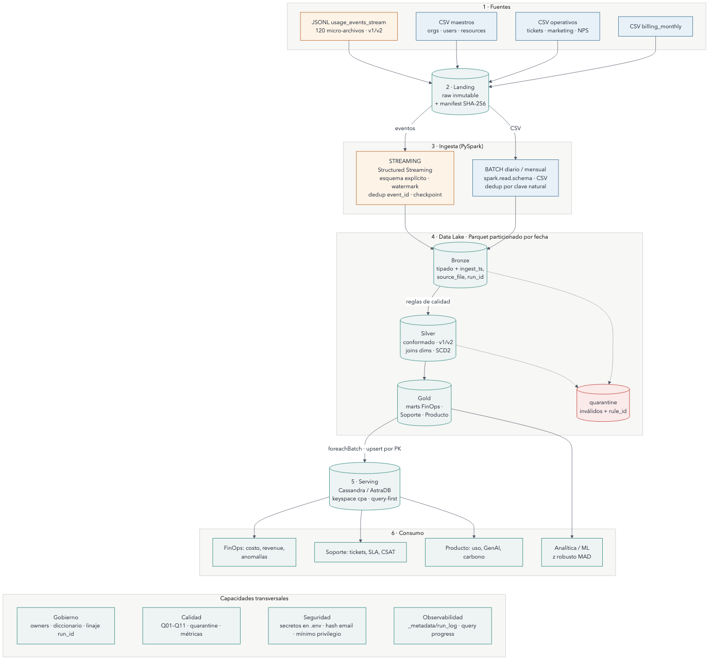

# Cloud Provider Analytics

Proyecto integrador · Big Data · ITBA · 2C 2026 · Prof. Diego Mosquera<br>
**Estado: Entrega 1 — Diseño y fundación de datos (05/10/2026)**<br>
Autora: Katia Menshikoff · Legajo 64396 (trabajo individual)

Pipeline ETL + Streaming + Serving para analítica de FinOps, Soporte y Producto de un proveedor cloud:
Landing → Bronze → Silver → Gold (Parquet) → Cassandra/AstraDB, con PySpark y Structured Streaming.



## Artefactos de la Entrega 1

| Artefacto (consigna, Sección 5.3) | Dónde |
|---|---|
| Documento de diseño | [`docs/01_documento_diseno.md`](docs/01_documento_diseno.md) (también en PDF: `docs/01_documento_diseno.pdf`) |
| Diagrama de arquitectura v1 | [`docs/diagramas/arquitectura_v1.png`](docs/diagramas/arquitectura_v1.png) · fuente `.mmd` |
| Matriz requisito-componente | Documento de diseño, Sección 6 |
| Plan inicial (supuestos, riesgos, esfuerzo, próximos pasos) | Documento de diseño, Secciones 10 a 12 |
| Inventario y diccionario de fuentes | [`docs/02_inventario_fuentes.md`](docs/02_inventario_fuentes.md) |
| Registro de decisiones | [`DECISIONS.md`](DECISIONS.md) |
| Evidencia de lectura y exploración | [`evidence/`](evidence/README.md) · [`notebooks/00_exploracion_landing.ipynb`](notebooks/00_exploracion_landing.ipynb) |
| Plan de correcciones (después del feedback) | [`docs/03_plan_correcciones.md`](docs/03_plan_correcciones.md) |

## Quickstart

Requisitos: Python 3.11+ y Java 17 o 21 (probado con Python 3.13, OpenJDK 21 y PySpark 4.0.1 en macOS).

```bash
python3 -m venv .venv && source .venv/bin/activate
pip install -r requirements.txt

# 1. Landing: descomprimir el dataset (inmutable) y verificar hashes
scripts/setup_landing.sh ruta/a/cloud_provider_challenge_dataset_v1.zip

# 2. Perfil de las fuentes -> evidence/profile/
python src/profiling/profile_landing.py

# 3. Flujo batch de referencia: MapReduce (Python puro) y su equivalente en PySpark -> evidence/mapreduce/
python src/mapreduce/daily_usage_mapreduce.py
python src/mapreduce/daily_usage_spark.py

# 4. Pruebas
pytest -q tests
```

**Google Colab:** subir el repo y el zip a Drive y ejecutar `!pip -q install -r requirements.txt` antes de los mismos comandos (con `!`). El notebook `notebooks/00_exploracion_landing.ipynb` lee la variable `CPA_LANDING` para encontrar Landing.

**Regenerar el PDF del documento de diseño** (requiere pandoc, poppler y Google Chrome): `python scripts/build_pdf.py`. El estilo, la portada y el tema de los diagramas están en `docs/estilo/`.

**Limpieza / reinicio:** `rm -rf evidence/mapreduce datalake && scripts/setup_landing.sh <zip>` deja el entorno como recién clonado.

## Estructura

```
README.md            objetivo, arquitectura, ejecución
DECISIONS.md         decisiones, alternativas y trade-offs
docs/                diseño, diagramas, diccionario, plan de correcciones
data/                cómo obtener los datos (no se versionan)
src/profiling/       perfil de Landing
src/mapreduce/       flujo batch de referencia (MapReduce + PySpark)
notebooks/           exploración con PySpark (Colab)
tests/               pruebas unitarias
config/              configuración de ejemplo, sin credenciales
infra/               (Entrega 2) docker-compose para Cassandra
evidence/            salidas que demuestran la ejecución
```

## Hallazgos principales de los datos
- 43.200 eventos en 120 micro-archivos; **cada archivo cubre los 60 días**. Con un watermark de 1 día se descartaría el 97,5 % de los eventos (D-05).
- Esquema v1 hasta el 17/07/2025; v2 desde el 18/07 agrega `carbon_kg` y `genai_tokens` (este último sólo para el servicio `genai`).
- `value` llega como string en 1.309 eventos y es nulo en 877; `unit` es nulo en 2.075; hay 216 costos negativos y 312 outliers por servicio+métrica.
- Facturación en USD/EUR/ARS con FX de USD ≠ 1 (D-06); 40 CSAT fuera de rango; 232 usuarios con `last_login < created_at`.

## Limitaciones de esta entrega
Por diseño de la consigna, la Entrega 1 no incluye implementación del pipeline. Bronze, Silver, Gold, streaming y Cassandra se implementan en la Entrega 2.
