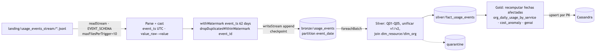
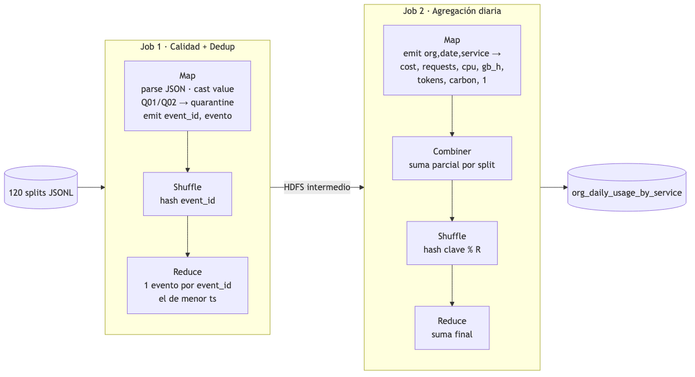

# Cloud Provider Analytics · Documento de diseño v1

**Primera evaluación parcial · Diseño y fundación de datos**<br>
Big Data · ITBA · 2C 2026 · Prof. Diego Mosquera<br>
Autora: Katia Menshikoff · Legajo 64396 (trabajo individual) · Versión 1.0 · Fecha de entrega: 05/10/2026

> Este documento cubre los 12 puntos del alcance obligatorio (Sección 5.2 de la consigna). Cada sección indica a qué punto responde.
> Todas las cifras sobre los datos salen de `evidence/profile/profile_report.md`, que genera `src/profiling/profile_landing.py` y se puede volver a generar.

---

## 0. Resumen ejecutivo

| Tema | Decisión v1 |
|---|---|
| Problema | Publicar datos confiables de **uso, costo, facturación, soporte y GenAI** de clientes de un proveedor cloud para FinOps, Soporte y Producto. |
| Patrón | **Lambda** con lógica compartida: *streaming* (Spark Structured Streaming) para `usage_events_stream`; *batch* diario/mensual para maestros, facturación, tickets y encuestas. |
| Data Lake | Landing (inmutable) → Bronze → Silver → Gold en **Parquet**, más `quarantine/`, `_checkpoints/` y `_metadata/`. |
| Procesamiento | PySpark 4.x (DataFrame API) en Google Colab / local `local[*]`. |
| Serving | Cassandra/AstraDB con tablas *query-first*, una por consulta obligatoria. |
| Hallazgo crítico | Los eventos llegan **desordenados**: cada archivo trae eventos de los 60 días. Con un watermark de 1 día se descartaría el **97,5 %** de los eventos. Ver Sección 8.3 y la decisión D-05. |
| Evidencia | Perfil reproducible de las 8 fuentes y un job MapReduce de referencia cuya salida coincide al 100 % con su versión Spark (11.050 claves). |

---

## 1. Interpretación del problema, usuarios, preguntas y objetivos medibles (consigna, Sección 5.2.1)

### 1.1 Problema
El área de datos del proveedor cloud recibe datos crudos con nulos, tipos ambiguos, costos negativos, outliers y un cambio de esquema a mitad del histórico (v1 → v2 el 18/07/2025, que agrega `carbon_kg` y `genai_tokens`). Hoy no existe una vista única y confiable que combine **uso casi en tiempo real** con **maestros y facturación**. El proyecto debe ingerir, limpiar, conformar y publicar esos datos para el consumo analítico.

### 1.2 Usuarios y preguntas de negocio

| Usuario | Dominio | Preguntas principales | Latencia que necesita |
|---|---|---|---|
| Analista FinOps | FinOps | ¿Cuánto cuesta y cuánto consume cada organización por servicio y por día? ¿Cuáles son los top-N servicios por costo en los últimos 14 días? ¿Qué costos son anómalos? ¿Cuál es el revenue mensual neto en USD? | Minutos para el costo incremental; D+1 para revenue |
| Líder de Soporte | Soporte | ¿Cómo evolucionan los tickets críticos y la tasa de SLA breach por día (últimos 30 días)? ¿Cuál es el CSAT por organización? | D+1 |
| Product Manager | Producto / GenAI | ¿Cuánto se usa cada servicio (requests, CPU, storage)? ¿Cuántos tokens GenAI se consumen por día y a qué costo? ¿Cuánto carbono se emite? | Horas / D+1 |
| Ingeniería de datos | Plataforma | ¿El pipeline corrió, cuántos registros entraron y cuántos quedaron en quarantine? ¿Es reprocesable? | Por corrida |

### 1.3 Objetivos medibles (criterios de éxito)

| ID | Objetivo | Métrica / umbral | Se verifica en |
|---|---|---|---|
| O1 | Frescura del uso | Evento → Gold `org_daily_usage_by_service` en **≤ 5 min** (trigger de 1 min) | Entrega 2 (logs de streaming) |
| O2 | Frescura batch | Maestros y facturación disponibles en Gold **antes de las 06:00 (D+1)** | Entrega 2 |
| O3 | Unicidad | **0** `event_id` duplicados en Silver/Gold, incluso tras re-ejecutar | Conteos antes/después |
| O4 | Calidad trazable | **100 %** de los registros terminan en Silver o en `quarantine` con motivo (no hay pérdida silenciosa) | `_metadata/run_log` |
| O5 | Trazabilidad | **100 %** de las filas de Bronze tienen `ingest_ts`, `source_file` y `run_id` | Reglas de calidad |
| O6 | Serving | Las 5 consultas obligatorias se resuelven con **una sola partición** de Cassandra cada una | CQL + capturas |
| O7 | Reproducibilidad | Pipeline ejecutable desde un entorno limpio con el Quickstart en **≤ 15 min** | README |

---

## 2. Justificación de Big Data con las 5V (consigna, Sección 5.2.2)

**La muestra entregada (13 MB, 43.200 eventos) entra en memoria y pandas la procesa sin problemas.** La justificación no se apoya en la muestra sino en el **sistema real que la muestra representa**. Por eso se usa el mismo código Spark en modo local, y escala sin reescribirse.

| V | Evidencia en la muestra | Proyección a un proveedor real | Implicancia de arquitectura |
|---|---|---|---|
| **Volumen** | 43.200 eventos / 60 días = 720 eventos/día sobre 400 recursos (~295 bytes por evento JSON). | Supuesto: 50.000 orgs × 40 recursos × 1 evento/min ≈ **2.900 M eventos/día ≈ 850 GB/día en JSON** (≈ 85–170 GB/día en Parquet comprimido) y ~300 TB/año. | Almacenamiento distribuido y columnar (Parquet), particionado por fecha, procesamiento *scale-out* con Spark. |
| **Velocidad** | Los eventos llegan en 120 micro-archivos; el costo es incremental (`cost_usd_increment`). | Flujo continuo; FinOps necesita detectar picos de costo en minutos, no al cierre de mes. | Structured Streaming con micro-batches, checkpoints y escrituras idempotentes. |
| **Variedad** | CSV tabulares, JSONL semi-estructurado con **dos versiones de esquema**, JSON embebido en CSV (`tags_json`) y texto libre (`comment` de NPS). | Más fuentes (CRM, billing, logs). | Esquemas explícitos, capa Silver de conformación y compatibilidad v1/v2. |
| **Veracidad** | 1.309 `value` como string, 877 `value` nulos, 2.075 `unit` nulos, 216 costos negativos, 312 outliers de costo, CSAT fuera de rango (40), `last_login < created_at` (232), FX de USD ≠ 1. | Igual o peor a escala. | Reglas de calidad verificables, quarantine en Parquet, métricas por corrida. |
| **Valor** | Mart diario de uso/costo, revenue en USD, SLA y GenAI. | Ahorro por detección temprana de anomalías de costo, prevención de churn (SLA/NPS) y adopción de GenAI. | Gold orientado a dominios + serving *query-first* en Cassandra. |

También es relevante la **variabilidad**: la distribución cambia en el tiempo (aparecen `carbon_kg` y `genai_tokens` en v2) y eso afecta tanto las reglas de calidad como los modelos de anomalías.

---

## 3. Inventario y perfil inicial de fuentes (consigna, Sección 5.2.3)

Detalle completo por columna en [`evidence/profile/profile_report.md`](../evidence/profile/profile_report.md) y diccionario en [`02_inventario_fuentes.md`](02_inventario_fuentes.md).

| Fuente | Grano (1 fila =) | Frecuencia / modo | Filas | Clave natural | Calidad: hallazgos principales | Trazabilidad | Riesgo |
|---|---|---|---|---|---|---|---|
| `customers_orgs.csv` | organización | snapshot batch (diario) | 80 | `org_id` | 11 `nps_score` nulos; 1 fuera de [-100,100]; 25 orgs con `plan_tier` incoherente con `is_enterprise` | sin timestamp de actualización → requiere SCD2 por hash | Medio |
| `users.csv` | usuario | snapshot batch | 800 | `user_id` | 139 `last_login` nulos; **232 con `last_login < created_at`**; `email` es PII | `created_at` | Medio (PII) |
| `resources.csv` | recurso cloud | snapshot batch | 400 | `resource_id` | 83 `tags_json` nulos; JSON embebido; 85 recursos con `pii:true` | `created_at` | Bajo |
| `support_tickets.csv` | ticket | batch diario (cambia estado) | 1.000 | `ticket_id` | 240 abiertos (sin `resolved_at`); 254 CSAT nulos; **40 CSAT fuera de [1,5]** | `created_at`/`resolved_at` | Medio |
| `marketing_touches.csv` | interacción | batch diario | 1.500 | `touch_id` | 96 `converted=True` sin `clicked=True` | `timestamp` (fecha) | Bajo |
| `nps_surveys.csv` | encuesta org-fecha | batch | 92 | `org_id+survey_date` | 19 `nps_score` nulos; 10 comentarios nulos | `survey_date` | Bajo |
| `billing_monthly.csv` | factura org-mes | batch mensual | 240 | `invoice_id` | 137 `credits` nulos; **13 subtotales negativos**; 3 monedas; **FX de USD entre 0,85 y 1,12**; 50 orgs facturan en más de una moneda | `month` | **Alto** (semántica FX) |
| `usage_events_stream/*.jsonl` | evento de uso | streaming (120 micro-archivos × 360) | 43.200 | `event_id` | 1.309 `value` string; 877 `value` nulos; 2.075 `unit` nulos; 216 costos < 0 (211 < −0,01); 312 outliers; esquema v1/v2; **llegada desordenada** | `timestamp` UTC, `event_id`, `schema_version` | **Alto** |

**Integridad referencial verificada:** el 100 % de los `org_id` y `resource_id` de los eventos existen en los maestros; `service` y `region` de cada evento coinciden con los del recurso. No hay `event_id` duplicados en este corte, pero el diseño igual deduplica, porque reprocesar o re-entregar archivos sí genera duplicados.

**Cobertura temporal:** eventos 03/07–31/08/2025 (60 días × 720); facturación 06–08/2025 (junio no tiene eventos, así que la reconciliación entre uso y facturación sólo es posible para julio y agosto); tickets 09/05–31/08/2025.

---

## 4. Arquitectura de alto nivel v1 (consigna, Sección 5.2.4)


_Fuente editable: [`diagramas/arquitectura_v1.mmd`](diagramas/arquitectura_v1.mmd) (Mermaid)._

**Responsabilidades por componente**

| Componente | Responsabilidad | Tecnología |
|---|---|---|
| Landing | Guardar los archivos tal como llegan, con hash SHA-256 para verificar que no cambian | Sistema de archivos / Google Drive (en producción: S3/GCS/HDFS) |
| Ingesta batch | Leer CSV con esquema explícito, agregar columnas técnicas, deduplicar por clave y escribir Bronze | PySpark `spark.read.schema(...)` |
| Ingesta streaming | Leer el directorio JSONL de forma incremental, aplicar watermark, deduplicar por `event_id` y hacer checkpoint | Spark Structured Streaming |
| Silver | Castear, normalizar, unificar v1/v2, hacer joins con dimensiones, tratar nulos y outliers, aplicar SCD2 | PySpark |
| Gold | Construir los marts por dominio con granos explícitos | PySpark / Spark SQL |
| Serving | Publicar los marts en tablas *query-first* con upserts idempotentes | Spark Cassandra Connector o driver Python en `foreachBatch` |
| Transversales | Calidad, metadatos, linaje, seguridad, observabilidad | `_metadata/run_log`, reglas en config, `.env` |

---

## 5. Patrón elegido y justificación (consigna, Sección 5.2.5)

**Decisión: Lambda con una única base de código de transformaciones (D-01).**

| Criterio | Batch puro | **Lambda (elegido)** | Kappa |
|---|---|---|---|
| Latencia de costos de uso (O1 ≤ 5 min) | ✗ (D+1) | ✓ streaming | ✓ |
| Maestros, facturación y NPS son snapshots pequeños y lentos | ✓ | ✓ batch | ✗: obliga a convertir CSV estáticos en streams sin beneficio |
| Facturación mensual con reconciliación | ✓ | ✓ | Complejo (re-stream completo) |
| Complejidad operativa | Baja | Media | Media-alta |
| Requisito invariable (streaming + batch) | ✗ | ✓ | ✓ (forzado) |

**Por qué Lambda:** la naturaleza de las fuentes ya está dividida. Los eventos son un flujo continuo y su valor cae con la demora (anomalías de costo). Los maestros y la facturación son lotes pequeños con cadencia diaria o mensual. Kappa nos haría tratar 80 organizaciones y 240 facturas como streams sin ganar nada.

**Mitigación de la desventaja clásica de Lambda (dos códigos):** en Spark, batch y streaming comparten la API de DataFrames. Las funciones de Silver/Gold (`conform_events(df)`, `build_daily_usage(df)`) se escriben una vez y se aplican tanto dentro de `foreachBatch` como en el *backfill* batch. La capa de *serving* es una sola (Cassandra) y el upsert por clave primaria reconcilia ambas rutas.

---

## 6. Mapeo de requisitos a componentes y relación 5V ↔ decisiones (consigna, Sección 5.2.6)

Leyenda: ● responsable principal · ○ participa.
Componentes: **LND** Landing · **BIN** ingesta batch · **SIN** ingesta streaming · **BRZ** Bronze · **SLV** Silver · **GLD** Gold · **QTN** quarantine · **CAS** Cassandra · **META** metadatos/run_log · **CFG** config/secretos.

| ID | Requisito (origen) | LND | BIN | SIN | BRZ | SLV | GLD | QTN | CAS | META | CFG | Evidencia prevista |
|---|---|---|---|---|---|---|---|---|---|---|---|---|
| R01 | Datos crudos inmutables (consigna, Sección 3.2) | ● | | | | | | | | ○ | | `landing_manifest.sha256` sin cambios |
| R02 | Ingesta batch CSV → Bronze Parquet particionado, esquema explícito, columnas técnicas (consigna, Sección 4.4) | ○ | ● | | ● | | | | | ○ | ○ | rutas + `printSchema` |
| R03 | Streaming JSONL con esquema, watermark, dedup `event_id`, late data, checkpoint (consigna, Sección 4.4) | ○ | | ● | ● | | | ○ | | ○ | ○ | `_checkpoints/`, query progress |
| R04 | Evolución de esquema v1/v2 (consigna, Sección 3.2) | | | ○ | ○ | ● | | | | | | conteos por `schema_version` |
| R05 | Tipos ambiguos con cast y fallback controlado (consigna, Sección 3.2) | | ○ | ○ | ○ | ● | | ○ | | | | `value_raw` vs `value` |
| R06 | Reglas de calidad + quarantine (consigna, Sección 4.4) | | | | ○ | ● | | ● | | ○ | ○ | muestras de quarantine |
| R07 | Normalización y joins con dimensiones (consigna, Sección 4.4, Silver) | | | | | ● | | | | | | tablas Silver |
| R08 | Features: `daily_cost_usd`, `requests`, `cpu_hours`, `storage_gb_hours`, `genai_tokens`, `carbon_kg` | | | | | ○ | ● | | | | | mart diario |
| R09 | Anomalías de costo (z robusto / MAD / percentiles) | | | | | ○ | ● | | | | ○ | `cost_anomaly_mart` |
| R10 | Marts FinOps, Soporte, Producto (consigna, Sección 7.3) | | | | | | ● | | ○ | | | 5 marts |
| R11 | Serving query-first en Cassandra (consigna, Sección 4.4) | | | | | | ○ | | ● | | ○ | CQL + capturas |
| R12 | Idempotencia (consigna, Sección 4.4) | | ○ | ● | ● | ● | ● | | ● | ○ | | conteos antes/después |
| R13 | Performance: particiones, coalesce, tamaños (consigna, Sección 4.4) | | ○ | ○ | ● | ● | ● | | | ○ | | tamaños por partición |
| R14 | Gobierno: metadatos, linaje, owners, seguridad (consigna, Sección 4.4) | ○ | | | ○ | ○ | ○ | | ○ | ● | ● | `run_log`, `DECISIONS.md` |
| R15 | Objetivos O1–O7 (Sección 1.3) | | ○ | ● | | | ○ | | ● | ● | | ver Sección 1.3 |

**Relación entre las 5V y las decisiones**

| V | Decisión de arquitectura que motiva | Componentes |
|---|---|---|
| Volumen | Parquet columnar + particionado por fecha; Spark *scale-out*; Cassandra particionada por org/fecha | BRZ, SLV, GLD, CAS |
| Velocidad | Structured Streaming con micro-batches y checkpoints; upsert idempotente en serving | SIN, CAS |
| Variedad | Esquemas explícitos por fuente; Silver unifica v1/v2; parseo de `tags_json` | BIN, SIN, SLV |
| Veracidad | Reglas de calidad declarativas, quarantine con motivo, métricas por corrida, dedup | SLV, QTN, META |
| Valor | Marts por dominio con granos explícitos y tablas por consulta | GLD, CAS |

---

## 7. Diseño del Data Lake (consigna, Sección 5.2.7)

### 7.1 Zonas, formato y reglas de promoción

```
datalake/
├── landing/                       # raw inmutable (tal cual llega; sólo lectura para el pipeline)
├── bronze/<entidad>/              # Parquet, mismo grano que la fuente + columnas técnicas
├── silver/<dim_|fact_><entidad>/  # Parquet conformado
├── gold/<mart>/                   # Parquet orientado a consumo
├── quarantine/<zona>_<entidad>/   # Parquet de registros rechazados + rule_id + motivo
├── _checkpoints/<query>/          # estado de Structured Streaming
└── _metadata/run_log/             # una fila por corrida y etapa: conteos, duración, estado
```

| Promoción | Condición para promover | Lo que no cumple |
|---|---|---|
| Landing → Bronze | El archivo parsea con el esquema explícito; se agregan `ingest_ts`, `source_file`, `run_id`; se deduplica por clave natural (eventos: `event_id`) | Líneas corruptas → `quarantine/bronze_<entidad>` (modo `PERMISSIVE` + `_corrupt_record`) |
| Bronze → Silver | Pasa las reglas de calidad *bloqueantes* (tabla 7.4); tipos casteados; v1/v2 unificados; joins con dimensiones válidos | → `quarantine/silver_<entidad>` con `rule_id` |
| Silver → Gold | En streaming, las fechas afectadas se recalculan en cada micro-batch y no son definitivas hasta superar el watermark. En batch, los datos pasan a Gold al terminar la corrida. Siempre se verifica que los conteos coincidan con Silver | La corrida queda en `FAILED` en el `run_log`; Gold no se pisa |
| Gold → Cassandra | Gold escrito con éxito (`_SUCCESS`) | Reintento; el upsert por PK es idempotente |

### 7.2 Tablas, particiones y modo de escritura

| Zona | Tabla | Grano | Partición | Modo de escritura | Justificación |
|---|---|---|---|---|---|
| Bronze | `usage_events` | evento | `event_date` | append (stream) | Poda por fecha; el reproceso es por día; consistente con el grano de Gold |
| Bronze | `customers_orgs`, `users`, `resources` | fila del snapshot | `ingest_date` | overwrite dinámico de partición | Cada snapshot es reproducible; < 100 KB, no conviene particionar por otra cosa |
| Bronze | `support_tickets`, `marketing_touches`, `nps_surveys` | fila | `ingest_date` | overwrite dinámico | Idem |
| Bronze | `billing_monthly` | factura | `month` | overwrite dinámico | Cadencia mensual natural |
| Silver | `fact_usage_events` | evento limpio | `event_date` | overwrite dinámico por fecha afectada | Idempotente ante late data |
| Silver | `dim_org` (SCD2), `dim_user`, `dim_resource` | entidad-versión | sin partición | overwrite | Tamaño chico; se usa en *broadcast join* |
| Silver | `fact_tickets`, `fact_billing`, `fact_nps`, `fact_marketing` | fila | mes | overwrite dinámico | Volumen bajo |
| Gold | `org_daily_usage_by_service` | org × día × servicio | `usage_date` | overwrite dinámico | Grano obligatorio (Entrega 2) |
| Gold | `revenue_by_org_month` | org × mes | `month` | overwrite dinámico | Consigna, Sección 7.3 |
| Gold | `cost_anomaly_mart` | org × día × servicio | `date` | overwrite dinámico | Consigna, Sección 7.3 |
| Gold | `tickets_by_org_date` | org × día × severidad | `date` | overwrite dinámico | Consigna, Sección 7.3 |
| Gold | `genai_tokens_by_org_date` | org × día | `date` | overwrite dinámico | Consigna, Sección 7.3 |

**Control de archivos chicos:** en la muestra, una partición diaria de eventos tiene ~720 filas, unos 25 KB en Parquet. Se aplica `coalesce(1)` por partición en Bronze/Silver/Gold para no generar cientos de *small files*. A escala real (~50 M eventos/día por partición) se pasaría a `repartition(n)` buscando archivos de 128–512 MB. No se particiona por `service` ni por `org_id`, porque multiplicaría por 6 y por 80 la cantidad de archivos.

### 7.3 Naming y convenciones
- Todo en `snake_case`, en inglés para tablas y columnas (como la fuente) y en español para documentación.
- Silver usa los prefijos `dim_` y `fact_`. Gold usa el nombre del mart de la Sección 7.3 de la consigna.
- Las columnas técnicas tienen nombres fijos: `ingest_ts`, `source_file`, `run_id`, `record_hash`; en SCD2 se agregan `valid_from`, `valid_to`, `is_current`.
- Fechas en UTC (`spark.sql.session.timeZone=UTC`, ver D-07); `event_ts` es el timestamp y `event_date` la fecha derivada.
- Montos con sufijo de moneda: `*_usd`, `*_local`.

### 7.4 Reglas de calidad iniciales (derivadas del perfil)

| ID | Regla | Tipo | Hallazgo que la motiva |
|---|---|---|---|
| Q01 | `event_id` no nulo y único | Bloqueante → quarantine | Clave de idempotencia |
| Q02 | `cost_usd_increment >= -0.01`; si es menor → quarantine con flag de anomalía | Bloqueante | 211 eventos < −0,01 (mín. −154,46) |
| Q03 | `unit` no nulo cuando `value` existe; si falta, se deriva de `metric` | Corrección | 2.075 `unit` nulos; la relación metric↔unit es 1:1 |
| Q04 | `value` casteable a double; si no, `value=null`, se conserva `value_raw` y se marca el flag | Corrección | 1.309 strings y 877 nulos |
| Q05 | `org_id` y `resource_id` existen en las dimensiones | Bloqueante | Hoy 0 huérfanos; protege a futuro |
| Q06 | `csat` dentro de [1,5]; si no, `null` + flag | Corrección | 40 fuera de rango |
| Q07 | `last_login >= created_at`; si no, flag `login_inconsistente` | Advertencia | 232 casos |
| Q08 | `exchange_rate_to_usd` dentro de un rango plausible por moneda | Advertencia | USD con FX ≠ 1 (ver D-06) |
| Q09 | `subtotal < 0` se marca como nota de crédito | Advertencia | 13 casos |
| Q10 | `credits` nulo → 0 | Corrección | 137 nulos |
| Q11 | Outlier de costo: \|z robusto (MAD) por servicio+métrica\| > 3,5 → flag (no se descarta) | Feature / anomalía | 312 eventos |

### 7.5 Retención

| Zona | Retención propuesta | Motivo |
|---|---|---|
| Landing | Indefinida (en producción: *cold storage* después de 90 días) | Es la fuente de verdad para reprocesar; inmutable |
| Bronze | 13 meses | Reprocesos y comparativas interanuales |
| Silver | 25 meses | Analítica histórica |
| Gold | 36 meses | Reporting financiero |
| Quarantine | 90 días | Diagnóstico y reinyección después de corregir |
| `_checkpoints` | Mientras exista la query; se borra solo en un *reset* controlado | Garantía *exactly-once* del sink |

### 7.6 Metadatos y linaje
- **A nivel fila:** `ingest_ts`, `source_file` (`input_file_name()`), `run_id`, `schema_version` y `record_hash` (para SCD2 y para detectar cambios).
- **A nivel corrida:** `_metadata/run_log` (Parquet) con `run_id`, etapa, tabla, `rows_in`, `rows_out`, `rows_quarantine`, duración, estado y versión de código (git SHA).
- **Linaje:** cada tabla Gold documenta sus tablas Silver de origen en el diccionario. El `run_id` permite recorrer el camino Gold → Silver → Bronze → `source_file`.
- **Owners:** cada dominio tiene un responsable (ver Sección 11).

---

## 8. Flujos de datos batch y streaming (consigna, Sección 5.2.8)

### 8.1 Flujo batch (maestros, facturación, tickets, NPS, marketing)

| Paso | Qué hace | Herramienta |
|---|---|---|
| 1 | Detectar archivos nuevos en `landing/` y registrar su hash | Python `hashlib`, manifest |
| 2 | Leer CSV con `StructType` explícito (sin `inferSchema`), `mode=PERMISSIVE` | `spark.read.schema().csv()` |
| 3 | Agregar `ingest_ts`, `source_file`, `run_id`; deduplicar por clave natural | `withColumn`, `input_file_name`, `dropDuplicates` |
| 4 | Escribir Bronze Parquet particionado | `write.partitionBy().mode("overwrite")` con `partitionOverwriteMode=dynamic` |
| 5 | Silver: castear, normalizar, aplicar SCD2 en `dim_org`, convertir facturación a USD, aplicar reglas Q06–Q10 | DataFrame API, `F.broadcast` para dimensiones |
| 6 | Gold: `revenue_by_org_month`, `tickets_by_org_date` | `groupBy/agg`, Spark SQL |
| 7 | Publicar en Cassandra (upsert) y escribir el `run_log` | Spark Cassandra Connector / `cassandra-driver` |

Orquestación v1: un script `run_batch.py` con etapas idempotentes, ejecutable desde Colab. En producción se usaría Airflow (fuera de alcance).

### 8.2 Flujo streaming (`usage_events_stream`)



_Fuente editable: [`diagramas/flujo_streaming.mmd`](diagramas/flujo_streaming.mmd) (Mermaid)._

- **Trigger:** `processingTime="1 minute"`; en la demo, `availableNow=True` para procesar los 120 archivos de forma determinística.
- **Simulación de micro-lotes:** `maxFilesPerTrigger=10` produce 12 micro-batches de ~3.600 eventos.
- **Checkpoint:** `_checkpoints/bronze_usage_events` y `_checkpoints/silver_usage`. Si el proceso se reinicia, no se reprocesan archivos ya confirmados.
- **Idempotencia del sink:** Bronze en modo append con checkpoint (*exactly-once* del file sink); Silver/Gold con overwrite dinámico de las particiones de fecha afectadas en cada micro-batch; Cassandra con upsert por clave primaria.

### 8.3 Late data: hallazgo crítico
El perfil muestra que **los 120 archivos contienen eventos de todo el rango 03/07–31/08**. La llegada no sigue el tiempo del evento. Simulamos un stream de un archivo por trigger y medimos qué fracción de eventos quedaría por detrás del watermark:

| Delay del watermark | Eventos que serían "tarde" | % |
|---|---|---|
| 1 hora | 42.801 | 99,1 % |
| 1 día | 42.118 | 97,5 % |
| 7 días | 37.831 | 87,6 % |
| 30 días | 21.421 | 49,6 % |
| 60 días | 0 | 0 % |

**Consecuencia:** un watermark "típico" (minutos u horas) haría que los operadores con estado descarten casi todo. **Propuesta (D-05, abierta):**
1. El stream a Bronze aplica `withWatermark("event_ts", "62 days")` + `dropDuplicatesWithinWatermark(["event_id"])`. El delay cubre el desorden observado (60 días) más 2 días de margen, así que con estos datos se pierde **0 %**. El estado queda acotado a ~43 k claves (unos pocos MB), viable para este volumen.
2. Si llega un evento más tarde que el watermark, Spark lo descarta en el operador con estado. Para que no se pierda en silencio, un batch diario de reconciliación compara las líneas por `source_file` en Landing (manifest) contra Bronze. Los faltantes se releen desde Landing y van a `quarantine/late_events` con su motivo.
3. Silver se procesa en `foreachBatch` y sobrescribe sólo las particiones de fecha que tocó cada micro-batch. En cada micro-batch se obtienen las fechas afectadas, se leen todos los eventos de Bronze de esas fechas y se reconstruye la partición completa de Silver. El micro-batch nunca reemplaza una partición por sí
4. Gold se recalcula para las **fechas afectadas** en cada micro-batch (overwrite dinámico), así un evento tardío corrige el agregado del día que corresponde.

A escala real, un watermark de 62 días no sería sostenible. Allí la deduplicación se haría con un *merge* por `event_id` sobre Silver (Delta/Iceberg). Lo dejamos como decisión abierta para validar en la Entrega 2.

---

## 9. Flujo batch de referencia con lógica MapReduce (consigna, Sección 5.2.9)

**Objetivo:** calcular el mart `org_daily_usage_by_service` (org × día × servicio) a partir de los eventos crudos.
Código: `src/mapreduce/daily_usage_mapreduce.py` (simulación en Python puro de Hadoop MR) y `src/mapreduce/daily_usage_spark.py` (equivalente PySpark).

### 9.1 Diseño en dos jobs encadenados



_Fuente editable: [`diagramas/mapreduce_referencia.mmd`](diagramas/mapreduce_referencia.mmd) (Mermaid)._

```text
Job 1   map(line):            e = parse(line)
                              if invalid(e): emit("__quarantine__", motivo)
                              else: emit(e.event_id, clean(e))          # value "12.5" → 12.5
        reduce(event_id, es): emit(event_id, min(es, key=ts))         # duplicados → quarantine

Job 2   map(e):               emit((e.org_id, date(e.ts), e.service),
                                   {cost: e.cost, e.metric: e.value, genai_tokens, carbon_kg, events: 1})
        combine(k, vs):       emit(k, sum(vs))      # pre-agregación local: menos datos en el shuffle
        reduce(k, vs):        emit(k, sum(vs))
```

### 9.2 Evidencia de ejecución (`evidence/mapreduce/mapreduce_stats.json`)

| Contador | Job 1 | Job 2 |
|---|---|---|
| Registros de entrada al map | 43.200 | 42.989 |
| Registros de salida del map | 43.200 | 42.989 |
| Registros en el shuffle | 43.200 | **28.377** (el combiner los reduce un 34 %) |
| Registros de salida del reduce | 43.200 | **11.050** claves org×día×servicio |
| Quarantine | 211 `costo_invalido` | — |

**Validación cruzada:** la salida MapReduce y la de PySpark coinciden en las **11.050 claves** y en todas las métricas (diferencia máxima < 1e-4, por redondeo). El plan físico de Spark (`evidence/mapreduce/spark_physical_plan.txt`) muestra la misma estructura: `HashAggregate(partial_sum)` (el combiner) → `Exchange hashpartitioning` (el shuffle) → `HashAggregate(sum)` (el reduce). Además hay un `Exchange` previo para `dropDuplicates(event_id)` (el Job 1).

**Lección:** en Hadoop, los dos jobs escriben su resultado intermedio a disco (HDFS replicado ×3). Spark ejecuta todo como un único DAG en memoria, que es la razón por la que elegimos Spark.

---

## 10. Supuestos, riesgos, mitigaciones y decisiones abiertas (consigna, Sección 5.2.10)

### 10.1 Supuestos
| ID | Supuesto |
|---|---|
| S1 | Los timestamps de eventos están en UTC (vienen con sufijo `Z`). |
| S2 | `cost_usd_increment` ya está en USD. Los valores negativos chicos (≥ −0,01) son ajustes por redondeo; los menores son anomalías. |
| S3 | `subtotal`, `credits` y `taxes` de facturación están en la moneda `currency`. El USD se obtiene como `(subtotal − credits + taxes) × exchange_rate_to_usd`. |
| S4 | `credits` nulo equivale a 0. |
| S5 | Los CSV de maestros son snapshots completos (no incrementales). |
| S6 | El NPS de `customers_orgs.nps_score` es un score agregado en [-100,100]; el de `nps_surveys` es un resultado de encuesta, no una respuesta individual 0–10. |
| S7 | El entorno de ejecución es Google Colab (2 vCPU, ~12 GB RAM) con persistencia en Google Drive, más AstraDB *free tier*. |

### 10.2 Riesgos y mitigaciones
| ID | Riesgo | Prob. | Impacto | Mitigación |
|---|---|---|---|---|
| K1 | Un watermark corto descarta casi todos los eventos (97,5 % con 1 día) | Alta | Alto | Watermark de 62 días + quarantine de tardíos + recomputo por fecha (D-05) |
| K2 | Semántica de FX ambigua (USD con FX ≠ 1; ARS a 0,0015) | Alta | Alto | Regla Q08, supuesto S3 documentado, validar con el docente; FX parametrizable |
| K3 | Colab es efímero: se pierden checkpoints y el lake | Alta | Medio | Lake y `_checkpoints` en Google Drive montado; script de *reset* |
| K4 | Conectividad o credenciales de AstraDB fallan durante la demo | Media | Alto | Secure bundle + token por variables de entorno; plan B: Cassandra en Docker; capturas de respaldo (Sección 8.4 de la consigna) |
| K5 | Desfase por zona horaria (verificado: Spark en hora local corrió fechas a 02/07 y generó 1.102 claves de más) | Alta | Medio | `spark.sql.session.timeZone=UTC` obligatorio en config (D-07) |
| K6 | *Small files* por particionar de más | Media | Bajo | Particionar sólo por fecha + `coalesce` (Sección 7.2) |
| K7 | PII (`email`, recursos con `pii:true`) expuesta en Gold | Media | Medio | Hash SHA-256 del email en Silver; no se publica en Gold ni en Cassandra |
| K8 | Trabajo individual: carga horaria alta, curva de aprendizaje de Streaming/Cassandra y una sola persona como punto único de falla | Media | Alto | Spikes técnicos tempranos (streaming y AstraDB en las primeras 2 semanas de la E2); backlog obligatorio/deseable; consultas tempranas al docente |

### 10.3 Decisiones abiertas (a cerrar con el feedback de la Entrega 1)
| ID | Pregunta | Opciones | Recomendación actual |
|---|---|---|---|
| A1 | ¿Cómo interpretar `exchange_rate_to_usd` para USD ≠ 1? | (a) aplicarlo igual; (b) forzar 1,0 para USD; (c) usar una tabla FX externa | (a) con flag Q08 |
| A2 | Watermark y late data (D-05) | 62 días / merge en Silver / sin watermark | 62 días + quarantine de tardíos |
| A3 | Formato de tabla | Parquet puro / Delta Lake | Parquet (lo pide la consigna); Delta como mejora opcional |
| A4 | Componente analítico/ML | z robusto/MAD (sin entrenamiento) / IsolationForest MLlib | MAD por servicio+métrica como base |
| A5 | Carga a Cassandra | Spark Cassandra Connector / `cassandra-driver` en `foreachBatch` | Driver en `foreachBatch` (más simple en Colab con AstraDB) |

### 10.4 Modelo de serving preliminar (*query-first*, a validar en la Entrega 2)
| Consulta obligatoria (consigna, Sección 7.4) | Tabla | PRIMARY KEY |
|---|---|---|
| Q1 Costos y requests diarios por org y servicio en un rango de fechas | `usage_by_org_day_service` | `((org_id), usage_date, service)` |
| Q2 Top-N servicios por costo acumulado en 14 días | `cost_14d_by_org_service` | `((org_id, as_of_date), cost_14d_usd, service)` - clustering DESC por costo (la partición se borra y se vuelve a escribir en cada corrida) |
| Q3 Tickets críticos y SLA breach por día (30 días) | `tickets_by_severity_day` | `((severity), date)` — sólo 4 particiones, *clustering* por fecha |
| Q4 Revenue mensual con créditos e impuestos en USD | `revenue_by_org_month` | `((org_id), month)` |
| Q5 Tokens GenAI y costo estimado por día | `genai_by_org_day` | `((org_id), date)` |

---

## 11. Estimación preliminar de esfuerzo, roles y recursos (consigna, Sección 5.2.11)

### 11.1 Roles
El trabajo se reparte por rol. Cada rol ordena una parte del trabajo y del backlog, y fija quién es owner de cada dominio (gobierno, Sección 7.6).

| Rol | Integrante | Responsabilidad | Dominios |
|---|---|---|---|
| Arquitecta de datos | Katia Menshikoff | Arquitectura, decisiones, documentación, integración y defensa | Gobierno, metadatos |
| Data Engineer batch + calidad | Julián Ariel Szarfmeser | Ingesta batch, Silver, reglas de calidad, marts de facturación y soporte | FinOps-revenue, Soporte |
| Data Engineer streaming | Iván Josephsohn | Structured Streaming, marts de uso y GenAI | FinOps-uso, Producto |
| Data Engineer serving + anomalías | Francisco Gomes | Cassandra/AstraDB, consultas CQL, detección de anomalías | FinOps-anomalías |

### 11.2 Esfuerzo estimado (horas)
| Fase | Entregable | Horas | Semanas disponibles | Horas/semana |
|---|---|---|---|---|
| E1 · Diseño y fundación (hasta 05/10) | Este documento, repo, perfil, MapReduce | 30 | — | — |
| E2 · Bronze batch + streaming | 3 maestros + eventos, checkpoints | 24 | | |
| E2 · Silver + calidad + quarantine | v1/v2, joins, Q01–Q11 | 20 | | |
| E2 · Gold + Cassandra + idempotencia | mart diario + 2 consultas | 20 | | |
| E2 · Gobierno + README + evidencias + backlog | | 12 | | |
| **Subtotal E2 (05/10 → 16/11)** | | **76** | 6 | **~13** |
| Final · Marts restantes, 5 consultas, ML/anomalías | | 26 | | |
| Final · Pruebas, documentación, video, defensa | | 22 | | |
| **Subtotal final (16/11 → 07/12)** | | **48** | 3 | **~16** |
| **Total** | | **154** | | |

Se suma un 20 % de contingencia (~30 h), concentrada en streaming y AstraDB. Con una sola persona la coordinación es mínima, pero no hay a quién repartir el trabajo. Por eso el backlog se ordena en **obligatorio / deseable / fuera de alcance** desde la Entrega 2, y lo deseable (por ejemplo Delta Lake o IsolationForest) sólo se encara si lo obligatorio está cerrado.

### 11.3 Recursos
| Recurso | Uso | Costo |
|---|---|---|
| Google Colab (CPU estándar) + Google Drive | Ejecución de PySpark y persistencia del lake | Gratis |
| PySpark 4.x, Java 17/21 | Motor | Libre |
| DataStax AstraDB (*free tier*) o Cassandra 5 en Docker | Serving | Gratis |
| GitHub (repo público) | Versionado, issues como backlog | Gratis |

---

## 12. Repositorio y evidencia (consigna, Sección 5.2.12)

- Estructura según la Sección 8.1 de la consigna: `README.md`, `docs/`, `data/`, `src/`, `notebooks/`, `tests/`, `config/`, `infra/`, `evidence/`, `DECISIONS.md`.
- **Evidencia mínima de lectura y exploración:**
  - `evidence/profile/profile_report.md` y `profile_summary.json`: perfil de las 8 fuentes.
  - `evidence/profile/landing_manifest.sha256`: huella de Landing para verificar que no se modifica.
  - `evidence/mapreduce/*`: salida y contadores del MapReduce, salida Spark y plan físico.
  - `notebooks/00_exploracion_landing.ipynb`: lectura con PySpark y esquema explícito (Colab).
  - `tests/`: 6 pruebas unitarias del flujo MapReduce (`pytest`).

## Próximos pasos (hacia la Entrega 2)
1. Incorporar el feedback de la Entrega 1 en el **plan de correcciones** (`docs/03_plan_correcciones.md`).
2. Implementar Bronze batch para `customers_orgs`, `users`, `billing_monthly`, y Bronze streaming para eventos.
3. Silver de eventos y reglas Q01–Q05; mart Gold `org_daily_usage_by_service`.
4. Keyspace `cpa` en AstraDB, tabla `usage_by_org_day_service` y consultas Q1/Q2.
